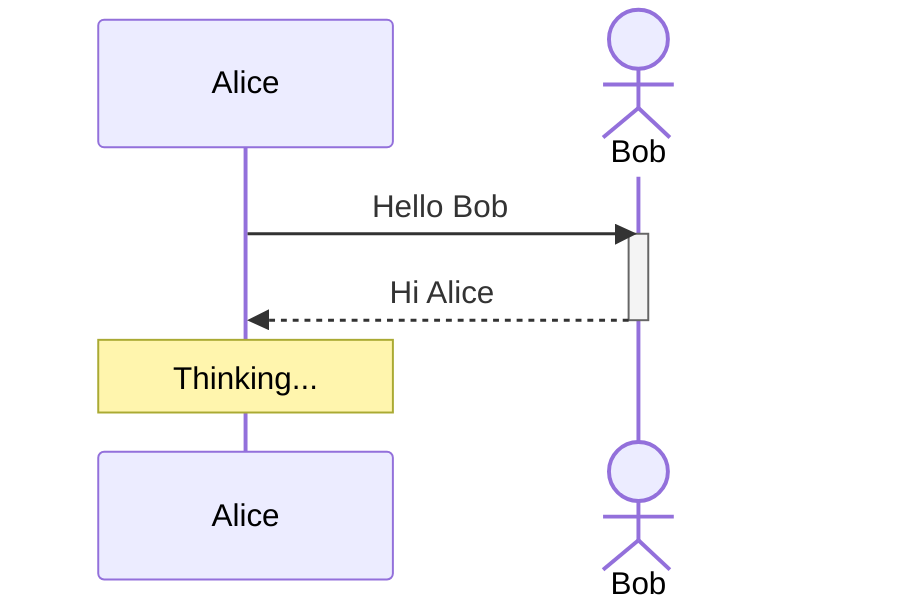

# SequenceDefiner

A web application that simplifies the creation of Mermaid sequence diagrams through an intuitive visual interface. Users can build sequence diagrams without needing to know Mermaid syntax, while the app generates and manages valid Mermaid code behind the scenes.

## Overview

SequenceDefiner is a focused tool for creating **sequence diagrams only**. It bridges the gap between Mermaid's powerful syntax and users who prefer a GUI-driven workflow. The app maintains a Mermaid source as the single source of truth, enabling seamless import and export of `.mmd` files.

## Tech Stack

| Layer        | Technology                              |
| ------------ | --------------------------------------- |
| Framework    | React 19 + TypeScript                   |
| Build tool   | Vite                                    |
| UI library   | shadcn/ui (Tailwind CSS + Radix UI)     |
| Rendering    | mermaid.js (sequence diagram rendering) |
| Persistence  | Browser LocalStorage                    |
| File format  | `.mmd` (raw Mermaid syntax)             |

## Application Layout

The app is composed of four main areas:

```
┌──────────────────────────────────────────────────┐
│                   Top Bar                        │
├────────────┬─────────────────────────────────────┤
│            │                                     │
│  Sidebar   │         Diagram Preview             │
│  (left)    │         (real-time rendering)        │
│            │                                     │
│            ├─────────────────────────────────────┤
│            │         Bottom Bar                  │
│            │         (add new elements)           │
└────────────┴─────────────────────────────────────┘
```

### 1. Top Bar

The top bar displays the application name and provides the main menu actions:

- **New Session** — clears the current diagram and starts fresh (with confirmation if unsaved changes exist)
- **Import File** — opens a file picker to load a `.mmd` file; the app parses the Mermaid syntax and populates the actor list, element list, and diagram preview
- **Export File** — downloads the current diagram as a `.mmd` file
- **Theme Toggle** — switches between light and dark mode

### 2. Sidebar (Left Panel)

The sidebar is divided into two sections:

#### Actors Section (top)

Displays the list of all actors (participants and actors) in the diagram. Each actor entry shows:

- The actor's display name (and alias if different)
- The actor's type icon (rectangle for `participant`, stick figure for `actor`)

Actor management operations:

- **Add** — create a new actor specifying name, optional alias, and type (`participant` or `actor`)
- **Remove** — delete an actor and all messages referencing it (with confirmation)
- **Rename** — edit an actor's display name or alias
- **Reorder** — drag-and-drop or move up/down to change the left-to-right order of actors in the diagram

#### Elements Section (bottom)

Displays the ordered list of all elements (messages, notes, activations/deactivations) in the diagram. Each element shows a human-readable summary (e.g., "Alice → Bob: Hello" or "Note over Alice: Thinking").

Element management operations:

- **Delete** — remove an element from the sequence
- **Reorder** — drag-and-drop or move up/down to change the order of elements in the sequence

### 3. Diagram Preview (Main View, top portion)

The main area renders the sequence diagram in real time using mermaid.js. Every change to actors or elements triggers an immediate re-render. The preview reflects exactly what the exported `.mmd` file would produce.

### 4. Bottom Bar (Main View, bottom portion)

The bottom bar is the primary interface for adding new elements to the diagram. It provides controls for:

#### Add Message (Arrow)

- **From** — dropdown to select the source actor
- **To** — dropdown to select the target actor
- **Label** — text input for the message label
- **Arrow type** — selector for the arrow style (see supported types below)
- **Add** button — appends the message to the element list

#### Add Activation / Deactivation

- **Actor** — dropdown to select which actor to activate or deactivate
- **Type** — toggle between `activate` and `deactivate`
- **Add** button — appends the activation/deactivation to the element list

#### Add Note

- **Position** — select `left of`, `right of`, or `over`
- **Actor(s)** — select one actor (or two actors for `over` spanning notes)
- **Text** — the note content
- **Add** button — appends the note to the element list

## Supported Mermaid Arrow Types

| Arrow              | Mermaid Syntax | Description                         |
| ------------------ | -------------- | ----------------------------------- |
| Solid line         | `->>`          | Solid line with arrowhead           |
| Solid line (open)  | `->`           | Solid line without arrowhead        |
| Dotted line        | `-->>`         | Dotted line with arrowhead          |
| Dotted line (open) | `-->`          | Dotted line without arrowhead       |
| Solid cross        | `-x`           | Solid line with cross at the end    |
| Dotted cross       | `--x`          | Dotted line with cross at the end   |
| Solid async        | `-)`           | Solid line with open arrow (async)  |
| Dotted async       | `--)`          | Dotted line with open arrow (async) |

## Mermaid Syntax (Internal Representation)

The app always maintains a valid Mermaid sequence diagram definition as its internal state. Example:



### Import

When a `.mmd` file is imported, the app parses the Mermaid source to extract:

1. Actor declarations (`participant`, `actor`) with names and aliases
2. Messages with arrow types and labels
3. Activation/deactivation statements
4. Notes

The parsed data populates the sidebar lists and the diagram preview.

### Export

The export function serializes the current internal state back to valid Mermaid syntax and triggers a browser download of the `.mmd` file.

## Persistence (LocalStorage)

The current diagram state is automatically saved to the browser's LocalStorage on every change. When the user returns to the app:

- The previous diagram is automatically restored
- No explicit "save" action is needed
- Starting a **New Session** clears the stored state (after confirmation)

## Theming

The app supports light and dark themes via shadcn/ui's built-in theming system. The user's theme preference is persisted in LocalStorage.

## Project Structure

```
src/
├── components/
│   ├── ui/               # shadcn/ui components
│   ├── TopBar.tsx         # App header with menu actions
│   ├── Sidebar.tsx        # Left panel container
│   ├── ActorList.tsx      # Actor management section
│   ├── ElementList.tsx    # Element list section
│   ├── DiagramPreview.tsx # Mermaid rendering area
│   ├── BottomBar.tsx      # Element creation controls
│   └── ThemeToggle.tsx    # Light/dark mode switch
├── hooks/
│   ├── useDiagram.ts      # Core diagram state management
│   ├── useLocalStorage.ts # LocalStorage persistence
│   └── useMermaid.ts      # Mermaid rendering logic
├── lib/
│   ├── mermaid-parser.ts  # Parse .mmd files into app state
│   ├── mermaid-serializer.ts # Serialize app state to .mmd
│   └── types.ts           # TypeScript type definitions
├── App.tsx
├── main.tsx
└── index.css
```

## Core Types

```typescript
type ActorType = "participant" | "actor";

interface Actor {
  id: string;
  name: string;
  alias?: string;
  type: ActorType;
}

type ArrowType = "->>" | "->'" | "-->>" | "-->" | "-x" | "--x" | "-)" | "--)";

interface Message {
  kind: "message";
  id: string;
  from: string;   // actor id
  to: string;     // actor id
  label: string;
  arrowType: ArrowType;
}

interface Activation {
  kind: "activation";
  id: string;
  actorId: string;
  type: "activate" | "deactivate";
}

interface Note {
  kind: "note";
  id: string;
  position: "left of" | "right of" | "over";
  actorIds: string[];  // one or two actor ids
  text: string;
}

type DiagramElement = Message | Activation | Note;

interface DiagramState {
  actors: Actor[];
  elements: DiagramElement[];
}
```

## Getting Started

```bash
# Install dependencies
npm install

# Start development server
npm run dev

# Build for production
npm run build

# Preview production build
npm run preview
```

## License

MIT
